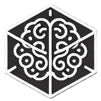

  <a href="https://google.com">
    
    <h3 align="center">Amixtra</h3>
  </a>

  Together, We Build Beyond

## The Rise of AI Technology: Unlocking the True Power of Communication

### **The Rise of AI Technology: Unlocking the True Power of Communication**

The world of technology is constantly evolving, and one of the most exciting advancements in recent years has been the development of [**LLMs (Large Language Models)**](https://en.wikipedia.org/wiki/Large_language_model). These powerful AI systems are reshaping how we interact with computers and each other, offering unprecedented capabilities to understand and generate human language. From enhancing customer support to empowering creative industries, LLMs are revolutionizing communication, and their transformative impact on society is just beginning to be realized.

At the heart of this movement is **Amixtra**, a company founded by two friends with a shared passion for pushing technological boundaries and a deep commitment to mutual support. Each founder brings unique strengths that beautifully complement the other’s expertise. One partner is a highly skilled developer with a background that includes multiple awards and experience as a [DevOps Engineer](https://en.wikipedia.org/wiki/DevOps) at the renowned [Amazon Web Services](https://en.wikipedia.org/wiki/Amazon_Web_Services). The other is a visionary solutions expert, known for innovative ideas that challenge convention and drive progress. Together, they united their talents to create Amixtra—a company founded on the principles of logic, creativity, and a dedication to solving complex problems quickly and accurately.

The name "**Amixtra**" itself speaks volumes about the company’s ethos. This coined term blends "amity" (meaning friendship or peaceful harmony) with "extra," symbolizing added value or strength. It’s a fitting name for a company that draws on the strength of friendship and camaraderie to bring an extra layer of commitment to every project. Amixtra is more than a business; it’s a partnership grounded in mutual respect, shared vision, and a relentless drive to make a difference.

### Together, We Build Beyond: Amixtra’s Mission and Values

Amixtra’s motto, *"Together, We Build Beyond,"* captures the spirit of its founders and their approach to both technology and business. In a world where technology often feels isolating, Amixtra believes in the power of connection—both between people and between people and machines. Every product, feature, and line of code is created with this in mind, pushing the limits of AI to create more meaningful, intuitive, and accessible tools.

At the core of Amixtra’s mission is a commitment to harnessing the power of partnership to bring innovative, people-centered solutions to life. This mission is reflected in the company’s values, each chosen to embody the principles that guide their work:

- **Collaboration** – Amixtra believes that the best solutions emerge from strong partnerships and mutual respect. Every decision is made with input from diverse perspectives, ensuring that each project benefits from a wealth of ideas and experiences.
- **Integrity** – Honesty and transparency are the bedrock of Amixtra’s relationships. The company is committed to ethical decision-making and maintaining open communication, creating a foundation of trust with clients, partners, and team members.
- **Innovation** – Innovation is more than a value at Amixtra; it’s a way of life. The team is passionate about creating products that push boundaries and deliver unique, impactful solutions tailored to the evolving needs of users.
- **Excellence** – Amixtra doesn’t settle for "good enough." Excellence is pursued in every aspect of the business, from product design to customer service, with a commitment to continuous improvement and high-quality outcomes.
- **Empathy** – At a time when AI is reshaping human interaction, Amixtra places a strong emphasis on empathy. The company listens, understands, and prioritizes the needs of clients and team members, ensuring that its AI solutions genuinely enhance people’s lives.

### Building the Future of Communication with AI

Amixtra’s journey is just beginning, but the company’s mission is clear: to build products that transform communication, empower individuals, and foster meaningful connections. By leveraging advanced LLM technology, Amixtra aims to create tools that are not only intelligent but also deeply human-centric, bridging the gap between complex AI capabilities and accessible, everyday use.

In an era where the potential of AI is rapidly unfolding, Amixtra is committed to using this technology responsibly and creatively. Each project is an opportunity to rethink what’s possible, crafting solutions that are not only technically sophisticated but also genuinely impactful. Through Amixtra’s work, AI becomes more than a tool; it becomes a bridge that brings people closer, facilitates understanding, and opens doors to new possibilities.

**Conclusion**

In a world where the pace of technological change can feel overwhelming, Amixtra stands as a reminder that technology can be both innovative and rooted in human values. *"Together, We Build Beyond"* isn’t just a motto—it’s the spirit that drives the team forward. Through a foundation of collaboration, integrity, innovation, excellence, and empathy, Amixtra is shaping the future of communication, one solution at a time. As the company continues to grow and develop, its mission remains steadfast: to create AI-driven tools that enhance lives, bridge connections, and inspire progress for a more connected world.